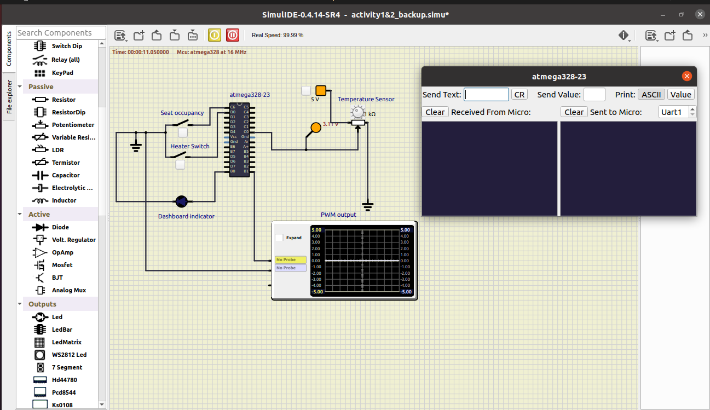

# Seat Temperature Controller
## Simulation Output
### LED and PWM output off

### LED on and PWM at 40% dutycycle

### LED on and PWM at 95% dutycycle

## CI and Code Quality

|Build|Cppcheck|
|:------:|:-----:|
|||